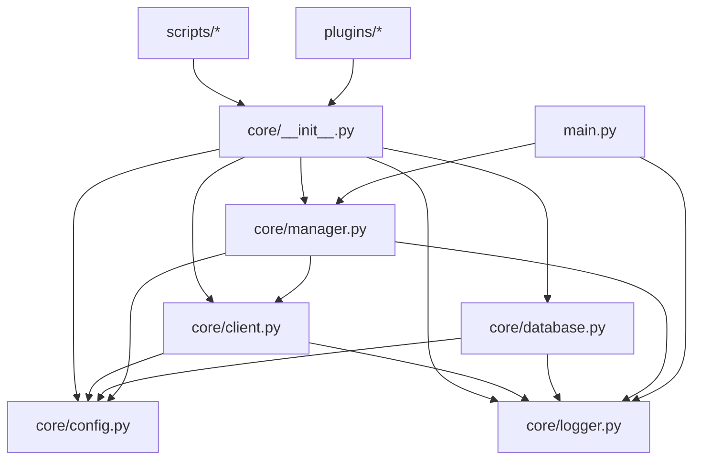

# Project Architecture

本项目是一个基于 Pyrogram 的 Telegram 人形脚本 (Userbot) 与 辅助机器人 (Assistant Bot) 双端管理系统。

## 1. 文件树结构

```text
tgbot-n/
├── main.py                 # 程序入口，负责启动和协调双端 Client
├── core/                   # 核心框架包
│   ├── __init__.py         # 统一导出接口，插件引用的唯一入口
│   ├── client.py           # 封装 Pyrogram Client，增加 ask、命令注册等功能
│   ├── config.py           # 配置加载与持久化管理 (TOML)
│   ├── database.py         # 数据库管理 (SQLAlchemy 异步)
│   ├── logger.py           # 统一日志工具，支持控制台与文件输出
│   └── manager.py          # 应用管理器，负责双端生命周期、插件预加载
├── config/                 # 配置文件目录
│   ├── default.toml        # 默认配置模板
│   └── config.toml         # 用户自定义配置 (私密，不提交)
├── plugins/                # 插件目录
│   ├── bot/                # 辅助机器人插件 (如登录、状态查询)
│   └── user/               # 人形脚本插件 (如 dme、ping)
├── scripts/                # 独立辅助脚本 (如初始登录工具)
├── utils/                  # 通用工具函数
├── logs/                   # 日志文件存放目录
└── requirements.txt        # 项目依赖
```

## 2. 模块职责

| 模块 | 职责 (Responsibility) | 非职责 (Non-Responsibility) |
| :--- | :--- | :--- |
| `main.py` | 程序生命周期起始、全局异常捕获、启动通知 | 具体的业务逻辑、Client 初始化细节 |
| `core/manager.py` | 管理 User/Bot 实例、插件预加载、配置更新协调 | 具体的 Telegram 协议处理 |
| `core/client.py` | 封装 Pyrogram 接口、实现交互式 `ask`、自动处理代理 | 业务逻辑分发 (由插件负责) |
| `core/config.py` | 读写 TOML 配置、提供全局配置变量 | 验证配置的业务有效性 |
| `core/database.py` | 管理 SQLAlchemy 异步引擎、Session 生命周期、自动建表 | 定义具体的业务模型 (由插件或单独模型文件负责) |
| `core/logger.py` | 格式化日志输出、维护日志文件、行号追踪 | 决定哪些信息该记录 (由调用者决定) |
| `plugins/` | 实现具体的业务功能 (命令处理器、事件监听) | 管理 Client 状态、读写核心配置文件 |

## 3. 引用拓扑图 (Reference Topology)



## 4. 修改协议 (Modification Protocol)
在进行任何代码修改前，如果涉及模块间的调用关系变化，**必须**先更新本文件中的“引用拓扑图”部分。
