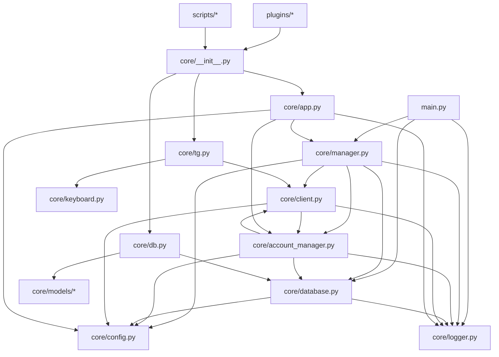

# Project Architecture

本项目是一个基于 Pyrogram 的 Telegram 人形脚本 (Userbot) 与 辅助机器人 (Assistant Bot) 双端管理系统。
**支持多账号**：多个 Userbot 账号可同时在线，每个账号独立运行、独立管理。

## 1. 文件树结构

```text
tgbot-n/
├── main.py                 # 程序入口，负责启动和协调 Bot + 多 Userbot
├── core/                   # 核心框架包
│   ├── __init__.py         # 统一导出接口，插件引用的唯一入口
│   ├── client.py           # 封装 Pyrogram Client，增加 ask、命令注册、模块过滤
│   ├── keyboard.py         # 键盘工厂，提供链式调用与自适应布局
│   ├── config.py           # 配置加载与持久化管理 (TOML)
│   ├── database.py         # 数据库管理 (SQLAlchemy 异步)，含数据迁移
│   ├── logger.py           # 统一日志工具，支持控制台与文件输出
│   ├── manager.py          # 应用管理器，负责 Bot 生命周期、插件预加载、全局配置
│   ├── account_manager.py  # 多账号管理器，负责所有 Userbot 账号的生命周期
│   ├── tg.py               # Telegram 组件门面，导出 Client、filters、types 等
│   ├── db.py               # 数据库门面，导出 Session、模型、设置函数
│   └── app.py              # 应用门面，导出 manager、account_manager、config、logger
├── config/                 # 配置文件目录
│   ├── default.toml        # 默认配置模板
│   └── config.toml         # 用户自定义配置 (私密，不提交)
├── plugins/                # 插件目录
│   ├── bot/                # 辅助机器人插件
│   │   ├── auth/           # 登录授权类 (如 login)
│   │   ├── admin/          # 管理配置类 (如 settings)
│   │   └── info/           # 状态信息类 (如 status)
│   └── user/               # 人形脚本插件
│       ├── info/           # 信息查询类 (如 id、ping)
│       ├── utils/          # 工具类 (如 dme、re、getmsg)
│       ├── gamble/         # 赌博类 (如 zhuque 压大小)
│       └── red_packet/     # 红包自动抢模块 (癫影按钮红包、朱雀红包等)
├── scripts/                # 独立辅助脚本 (如初始登录工具、通知工具)
├── utils/                  # 通用工具函数
├── models/                 # 数据库模型目录 (旧版迁移)
├── logs/                   # 日志文件存放目录
├── migrations/             # Alembic 迁移目录
└── requirements.txt        # 项目依赖
```

## 2. 模块职责

| 模块 | 职责 (Responsibility) | 非职责 (Non-Responsibility) |
| :--- | :--- | :--- |
| `main.py` | 程序生命周期起始、全局异常捕获、启动通知 | 具体的业务逻辑、Client 初始化细节 |
| `core/manager.py` | 管理 Bot 实例、全局配置 (prefix/owner_id)、插件预加载 | Userbot 账号生命周期管理 (由 account_manager 负责) |
| `core/account_manager.py` | 管理所有 Userbot 账号：加载/启动/停止/添加/移除，按 owner_id 隔离模块开关 | Bot 管理、全局配置 |
| `core/client.py` | 封装 Pyrogram 接口、实现交互式 `ask`、自动处理代理、模块级开关拦截 | 业务逻辑分发 (由插件负责) |
| `core/keyboard.py` | 提供 InlineKeyboardMarkup 的对象化封装、链式构建及自适应布局逻辑 | 具体的业务按钮定义 (由插件负责) |
| `core/config.py` | 读取静态 TOML 配置、提供基础连接变量 | 验证配置的业务有效性、管理动态设置 |
| `core/database.py` | 管理 SQLAlchemy 异步引擎、Session 生命周期、自动建表、处理数据库降级与自动迁移 | 定义具体的业务模型 (由单独模型文件负责) |
| `core/logger.py` | 格式化日志输出、维护日志文件、行号追踪 | 决定哪些信息该记录 (由调用者决定) |
| `plugins/` | 实现具体的业务功能 (命令处理器、事件监听) | 管理 Client 状态、读写核心配置文件 |

## 3. 引用拓扑图 (Reference Topology)



## 4. 多账号架构说明

### 4.1 核心概念

- **Bot Owner**: 第一个通过 `/login` 绑定的用户自动成为 Bot Owner，拥有管理所有账号的权限
- **普通用户**: 通过 `/login` 绑定自己的账号，只能管理自己的账号
- **身份验证**: 登录时必须验证 `get_me().id == message.from_user.id`，防止账号冒用

### 4.2 数据模型

```text
UserAccount (user_accounts 表)
├── owner_id: BigInteger (PK)  # 用户的 Telegram User ID
├── phone: String (unique)     # 手机号
├── session_string: Text       # Pyrogram Session String
├── is_active: Boolean         # 是否启用
├── is_connected: Boolean      # 当前是否在线
├── created_at: DateTime
└── updated_at: DateTime

BonusLog (bonus_logs 表)
├── owner_id: BigInteger (FK)  # 所属账号 ID，区分各账号流水

ZhuqueResult (zhuque_results 表)
├── ... (全局游戏数据，不按账号隔离)
```

### 4.3 模块隔离

每个账号的模块开关 (`disabled_modules`) 按 `disabled_modules:{owner_id}` 键名存储在 `system_settings` 表中，实现账号级别的功能隔离。

### 4.4 数据迁移

启动时自动执行 `migrate_session_to_account()`:
1. 读取旧版 `system_settings` 中的 `session_string` 和 `owner_id`
2. 创建对应的 `UserAccount` 记录
3. 删除旧版 `session_string` 键

## 5. 修改协议 (Modification Protocol)

在进行任何代码修改前，如果涉及模块间的调用关系变化，**必须**先更新本文件中的"引用拓扑图"部分。

### 5.1 跨模块修改影响范围检查

修改以下模块时，必须同步检查并更新受影响的文件：

| 修改的模块 | 可能受影响的文件 |
|:---|:---|
| `core/account_manager.py` | `core/manager.py`, `core/app.py`, `core/client.py`, `plugins/bot/auth/login.py`, `plugins/bot/admin/settings.py` |
| `core/manager.py` | `core/app.py`, `main.py`, `plugins/bot/*` |
| `core/client.py` | `core/manager.py`, `core/account_manager.py`, `plugins/*` |
| `core/database.py` | `core/account_manager.py`, `core/manager.py`, `scripts/*` |
| `core/models/*` | `core/database.py`, `core/db.py`, `plugins/*` |

### 5.2 循环依赖检测

严禁产生循环引用。特别注意：
- `manager.py` 引用 `account_manager.py`，同时 `account_manager.py` 不能引用 `manager.py`
- `client.py` 引用 `account_manager.py`，同时 `account_manager.py` 不能引用 `client.py` 的业务逻辑

## 6. 子门面导出规范 (Sub-facade Export)

为了避免 `core/__init__.py` 过度臃肿，采用分组导出模式：
- `core.tg`: 包含 Client, filters, types, enums, Keyboards 等 Telegram 相关组件。
- `core.db`: 包含数据库 Session, 模型, 设置读写函数。
- `core.app`: 包含管理器 (manager), 多账号管理器 (account_manager), 配置常量, 日志工具。
