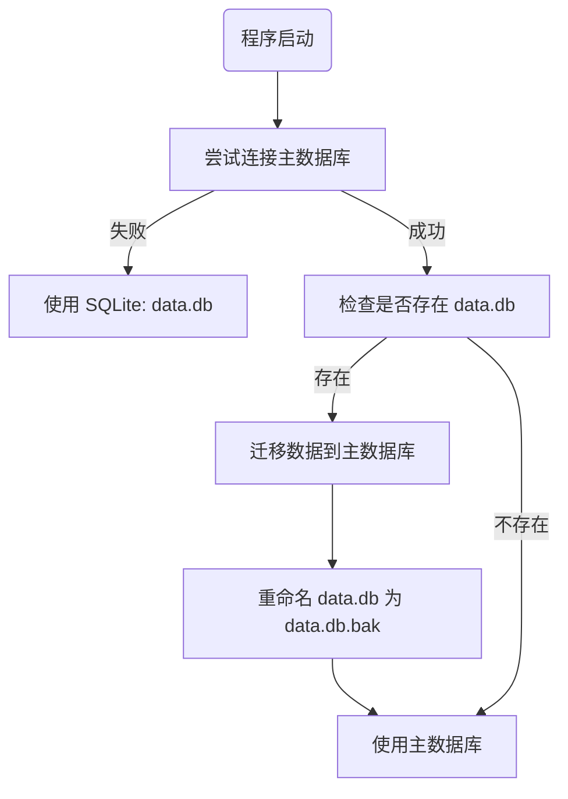

# 数据库降级与自动迁移计划

## 1. 目标
1.  **降级 (Fallback)**: 当主数据库连接失败时，自动切换到本地 SQLite (`data.db`)。
2.  **迁移 (Migration)**: 当主数据库恢复连接时，自动将本地 SQLite 中的数据（至少包括 `system_settings`）迁移到主数据库。

## 2. 依赖更新
- `aiosqlite`: 用于异步操作 SQLite。

## 3. 核心逻辑实现 (`core/database.py`)

### 3.1 降级逻辑
在 `init_db()` 中：
1.  尝试连接 `DATABASE_URL`。
2.  若失败，切换到 `sqlite+aiosqlite:///data.db` 并初始化。

### 3.2 迁移逻辑
在 `init_db()` 成功连接主数据库后：
1.  检查当前目录下是否存在 `data.db`。
2.  若存在，启动迁移流程：
    - 同时建立 SQLite 和主数据库的连接。
    - 读取 SQLite 中的 `system_settings` 记录。
    - 写入（Upsert）到主数据库中。
    - (可选) 迁移 `zhuque_results` 等其他业务数据。
3.  迁移完成后，将 `data.db` 重命名为 `data.db.bak` 以防重复迁移。

## 4. 任务清单
1. [ ] 更新 `requirements.txt`。
2. [ ] 在 `core/database.py` 中实现 `migrate_from_sqlite(sqlite_url)` 函数。
3. [ ] 修改 `init_db`：
    - 增加连接测试。
    - 增加降级逻辑。
    - 增加迁移触发逻辑。
4. [ ] 验证：
    - 模拟主库失败 -> 写入数据到 SQLite -> 修复主库 -> 重启程序 -> 验证数据已迁移到主库。

## 5. 流程图

