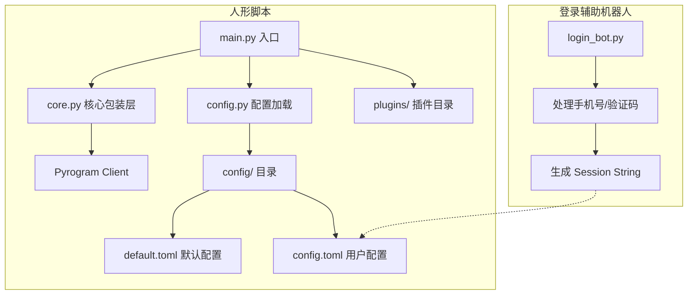

# Telegram 人形脚本 (Userbot) & 登录辅助 Bot 开发计划

这是一个基于 Kurigram 库的 Telegram 人形脚本开发计划，包含一个专门用于生成 Session String 的辅助机器人。

## 1. 系统架构



## 2. 目录结构

- `core.py`: **新增加**。核心包装层，统一管理底层库（如 Pyrogram）的引用，方便未来迁移或扩展。
- `login_bot.py`: 一个独立的脚本，运行后作为一个 Bot，引导用户输入手机号和验证码，最后输出 `SESSION_STRING`。
- `main.py`: 人形脚本启动入口。
- `config.py`: 配置加载逻辑（支持 `default.toml` 回退）。
- `config/`:
  - `default.toml`: 包含 API_ID, API_HASH, BOT_TOKEN (用于登录Bot) 以及**代理配置**等。
  - `config.example.toml`: **新增加**。配置文件示例，用户可参考此文件创建 `config.toml`。
  - `config.toml`: 存储生成的 `SESSION_STRING` 和用户私有配置。
- `plugins/`: 插件目录。

## 3. 待办事项清单

1.  **环境准备**:
    - 创建 `config/` 目录及 `default.toml`。
    - 编写 `requirements.txt`。
2.  **核心包装层 (Core Layer)**:
    - 编写 `core.py`: 封装 `pyrogram` 的常用类和方法，**集成代理自动加载逻辑**。
3.  **登录辅助机器人 (Login Bot)**:
    - 编写 `login_bot.py`: 使用 `BOT_TOKEN` 启动，通过对话引导用户完成 Telegram 登录授权。
    - 输出 `SESSION_STRING` 供用户填入 `config.toml`。
4.  **核心开发**:
    - 编写 `config.py` (配置合并逻辑)。
    - 编写 `main.py` (Userbot 初始化)。
5.  **功能插件**:
    - 实现 `ping` 插件。

## 4. 开发规范与安全提示

- **库引用说明**: 本项目在 `requirements.txt` 中使用 `kurigram`，但在 Python 代码中**统一通过 `core.py` 引用**。严禁在业务代码中直接 `import pyrogram`。
- **代理配置**: 代理配置在 `config/default.toml` 或 `config/config.toml` 的 `[proxy]` 节点下管理。`core.Client` 会自动读取并应用这些配置。
- **安全提示**: `SESSION_STRING` 等同于你的账号密码，绝对不要泄露。
- `config/config.toml` 必须加入 `.gitignore`。

## 5. 常见问题与解决方案 (Skill Notes)

### 5.1 RuntimeError: This event loop is already running
**问题描述**: 在使用 `asyncio.run(main())` 启动脚本时，如果调用 `app.run()` 会报错，因为 `app.run()` 内部会尝试启动一个新的事件循环。
**解决方案**: 在已经运行的异步函数中，不要使用 `app.run()`，而应改用以下方式：
```python
await app.start()
await idle()
await app.stop()
```
本项目已在 `main.py` 和 `login_bot.py` 中统一采用此写法。

### 5.2 TgCrypto is missing!
**问题描述**: 提示缺少 `TgCrypto`，虽然不影响功能但会降低加密/解密速度。
**解决方案**: 在 `requirements.txt` 中添加 `tgcrypto`。

### 5.3 AttributeError: 'Client' object has no attribute 'ask'
**问题描述**: 调用 `client.ask` 时报错，因为 Pyrogram 原生不支持对话式交互。
**解决方案**: 在 `core.py` 中手动实现了一个轻量级的 `ask` 方法。该方法通过在 `core.Client` 中维护一个等待队列，并使用高优先级处理器（group=-100）拦截消息来实现。这种方式比使用第三方库（如 `pyromod`）更轻量，且能有效避免事件循环冲突问题。

---

**计划已更新：修复了事件循环冲突问题，并添加了常见问题记录。**
