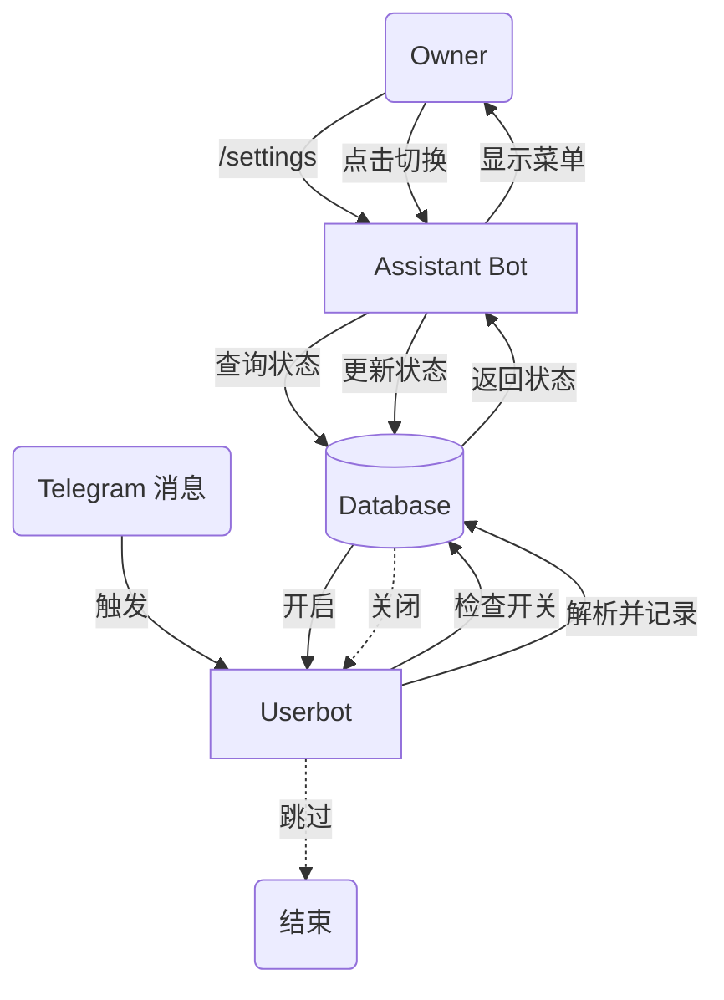

# Zhuque 数据记录开关实现计划

## 1. 目标

在 Bot 中实现一个开关，控制是否记录 Zhuque YDX 的数据，并将该设置持久化存储在数据库中。

## 2. 数据库设计

在 `core/database.py` 中新增 `SystemSetting` 模型，用于存储通用的 key-value 配置。

- **表名**: `system_settings`
- **字段**:
  - `key` (String, Primary Key): 配置项名称（如 `zhuque_record`）
  - `value` (String): 配置项值（如 `true` 或 `false`）

## 3. 核心功能扩展

在 `core/database.py` 中实现以下辅助函数：

- `get_setting(key: str, default: str) -> str`: 异步获取配置。
- `set_setting(key: str, value: str)`: 异步设置配置。

并在 `core/__init__.py` 中导出这两个函数。

## 4. 交互界面 (Assistant Bot)

在 `plugins/bot/settings.py` 中实现以下功能：

- **/settings 指令**:
  - 仅 Owner 可用。
  - 发送一个带有内联按钮（Inline Keyboard）的消息。
  - 按钮显示当前 "Zhuque 记录" 的状态（✅ 开启 / ❌ 关闭）。
- **Callback Query 处理**:
  - 点击按钮时，更新数据库中的配置并刷新消息显示。

## 5. 业务逻辑集成

修改 `plugins/user/zhuque.py`：

- 在 `zhuque_handler` 函数开始处，调用 `get_setting("zhuque_record", "true")`。
- 如果返回值为 `"false"`，则直接跳过记录逻辑。

## 6. 任务清单

1. [ ] 修改 `core/database.py` 添加模型和工具函数。
2. [ ] 修改 `core/__init__.py` 导出接口。
3. [ ] 新增 `plugins/bot/settings.py` 实现交互逻辑。
4. [ ] 修改 `plugins/user/zhuque.py` 实现逻辑判断。
5. [ ] 测试验证。

## 7. 流程图

